# Testes feitos
Todas as funcionalidades do software foram testadas e printadas para comprovar o funcionamento do sistema, algumas das principais funções abaixo:
## Menu 
<h1 align="center">
  
</h1>

## Menu Funcionário
<h1 align="center">
  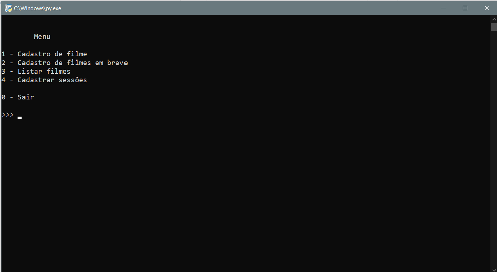
</h1>

## Cadastrar filmes atuais e breves
<h1 align="center">
  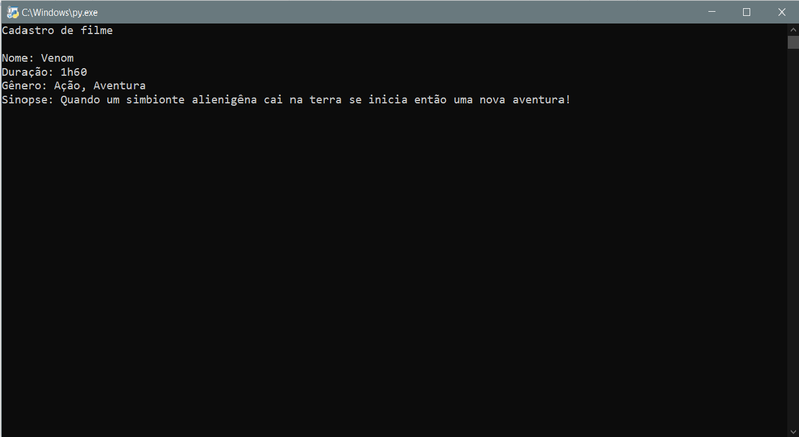
</h1>

## Cadastrar Sessão
<h1 align="center">
  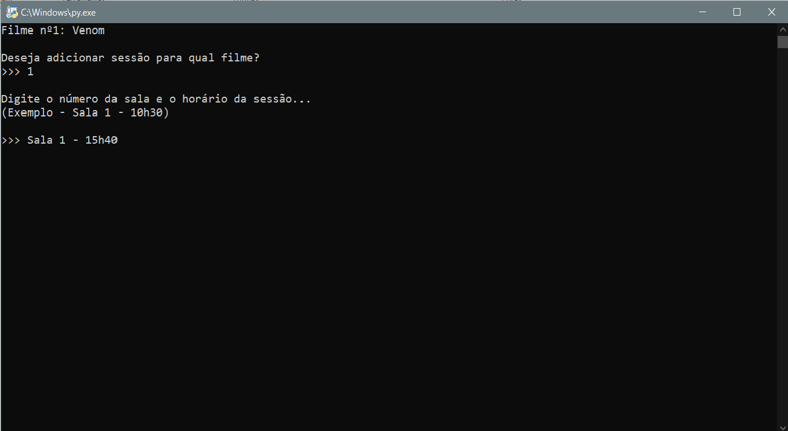
</h1>

## Menu Programação
<h1 align="center">
  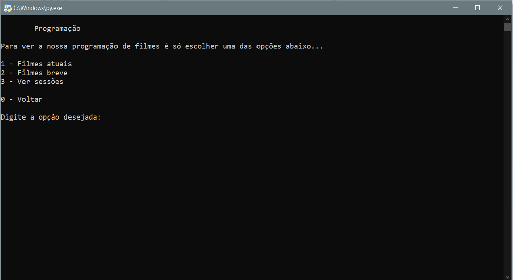
</h1>

## Listar filmes atuais e breves
<h1 align="center">
  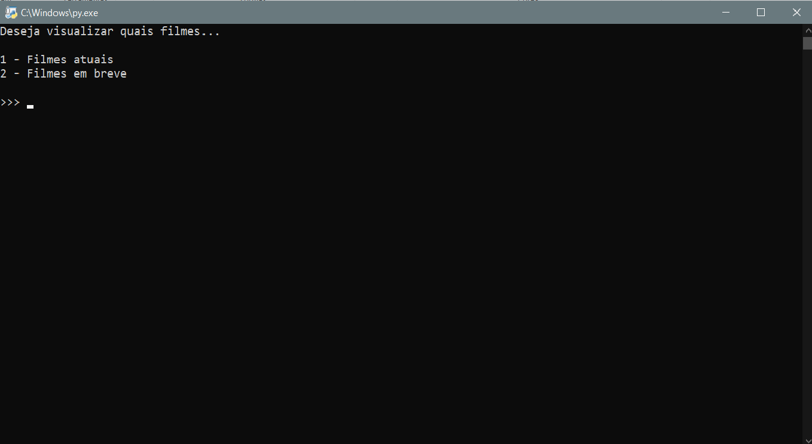
  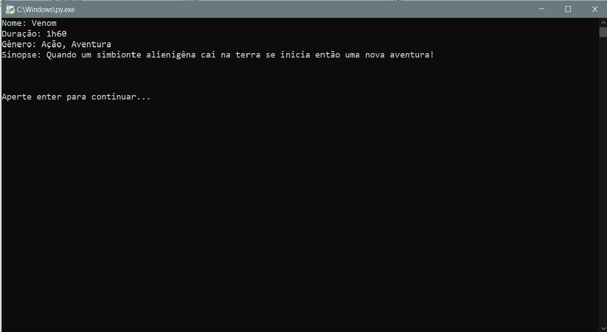
  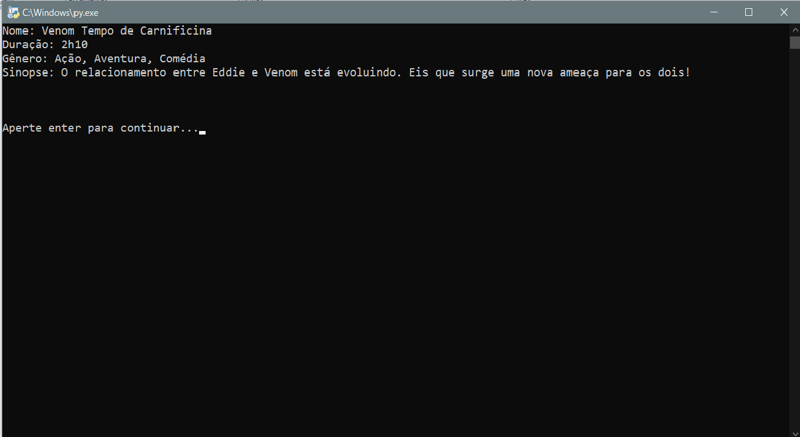
</h1>

## Sessões
<h1 align="center">
  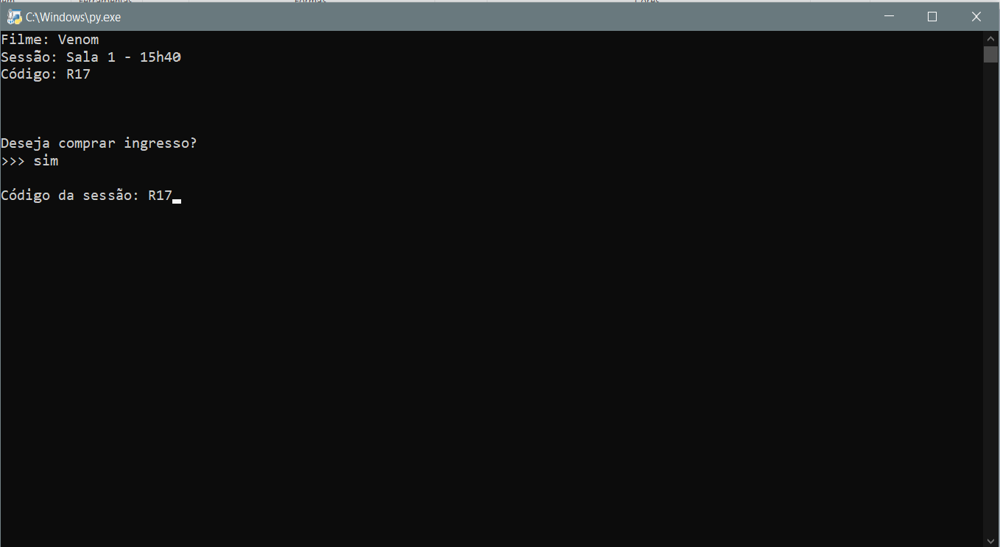
</h1>

## Sala
<h1 align="center">
  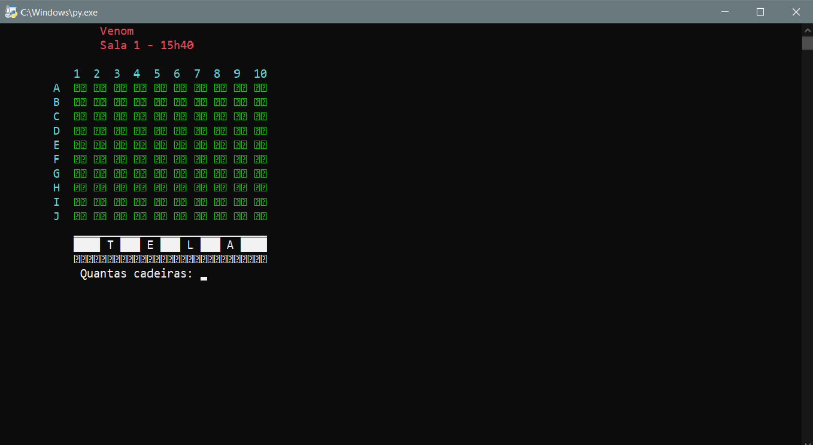
  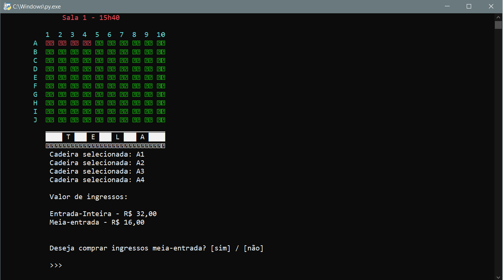
</h1>

## Ingressos
<h1 align="center">
  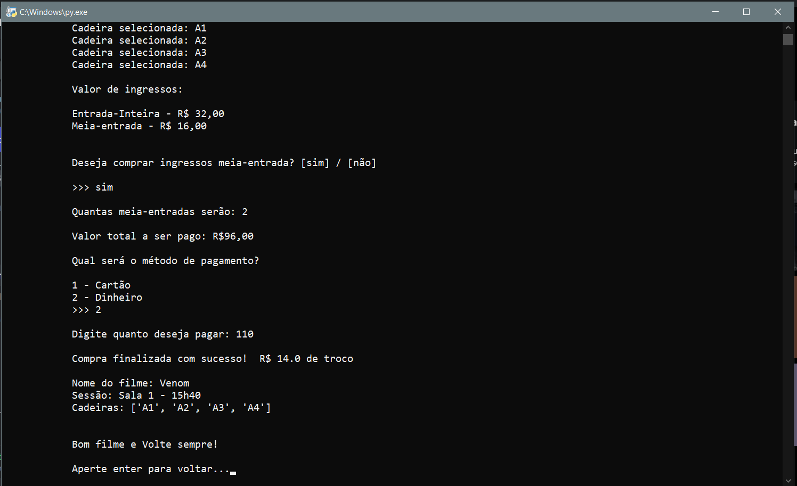
  
  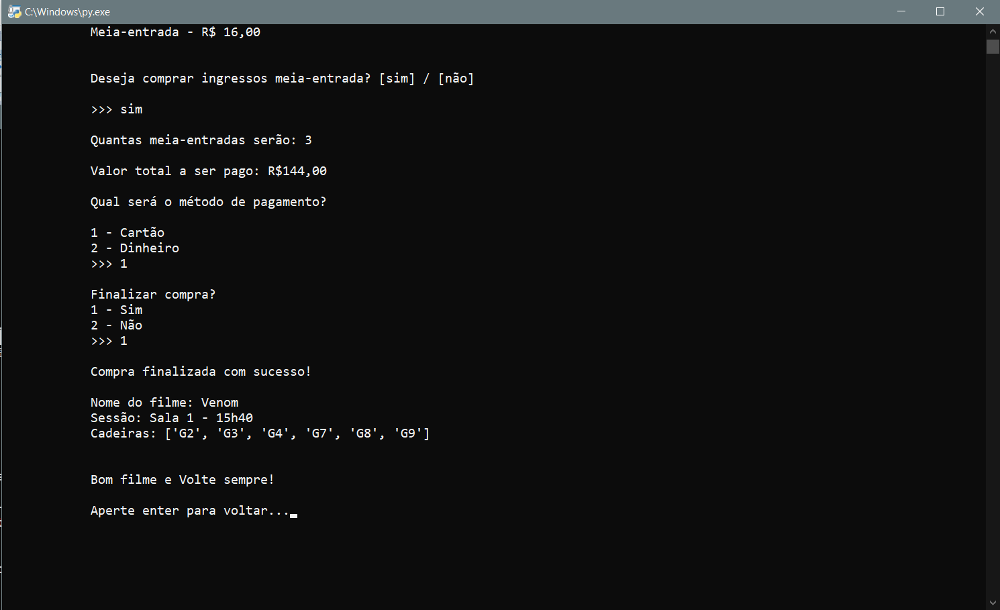
</h1>

Projeto_Cinema 🎥

